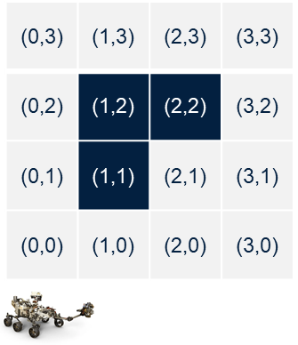
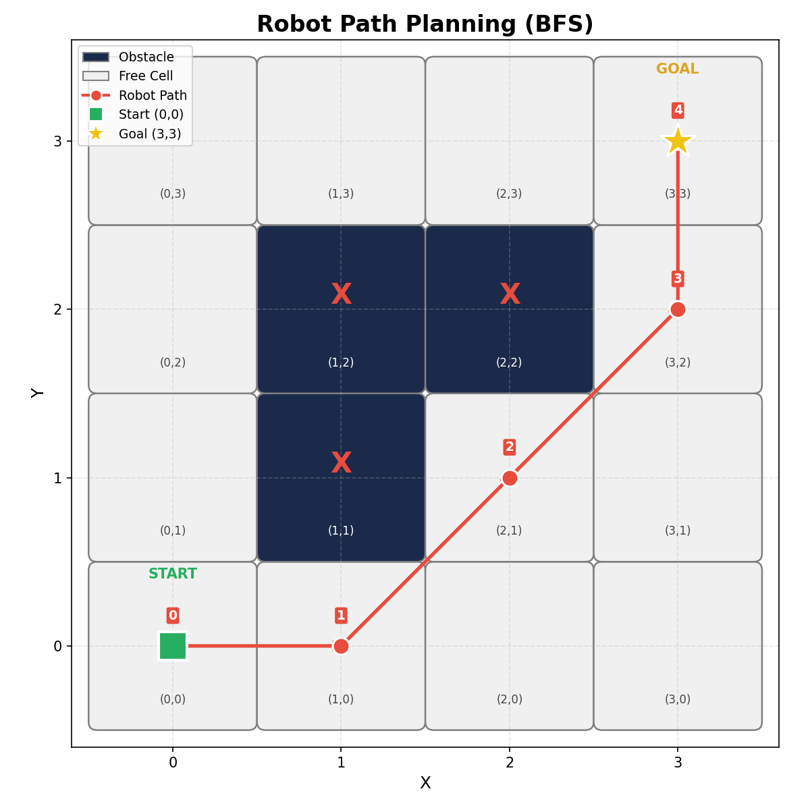

# Robot Path Planning on a 2D Grid

## Assignment

Write a Python program that moves a robot from a start position to a goal on a 2D grid while avoiding obstacles.

### Requirements



- The robot starts at **(0, 0)**
- The robot must reach **(3, 3)**
- Obstacles are located at **(1,1)**, **(1,2)**, and **(2,2)**
- The robot must avoid collisions with obstacles
- Every iteration, the robot checks all surrounding grid cells and moves **1 cell at a time**
- The robot operates on a **2D grid with a cell size of 1×1**

### Deliverables

1. A **screenshot of the path plot**
2. The **implementation code**

---

## Setup

### Prerequisites

- **Python 3.6** or higher

### Install Dependencies

The project uses **matplotlib** for plotting. Install it by running:

```
pip install matplotlib
```

> All other modules used (`collections`, `deque`) are part of Python's standard library and do not need to be installed.

---

## How to Run

1. Open a terminal in the project folder
2. Run the script:

```
python robot_pathfinding.py
```

3. The program will:
   - Print the shortest path found
   - Print a step-by-step movement log showing what the robot checks at each iteration
   - Save a plot of the path as `robot_path_plot.png` in the same folder

---

## Code Comments

The code contains detailed inline comments throughout. These are included for **educational purposes** to explain the logic and help with understanding each step of the implementation.

---

## Algorithm

The program uses **BFS (Breadth-First Search)** with 8-directional movement (up, down, left, right, and all four diagonals). BFS guarantees the shortest collision-free path on an unweighted grid.

---

## Output

### Path Found

```
Step 0: (0, 0)  <-- START
Step 1: (1, 0)
Step 2: (2, 1)
Step 3: (3, 2)
Step 4: (3, 3)  <-- GOAL
```

### Plot



The generated plot (`robot_path_plot.png`) shows:

- **Dark cells** — obstacles
- **Light cells** — free space
- **Red line with numbered steps** — the robot's path
- **Green square** — start position
- **Gold star** — goal position
